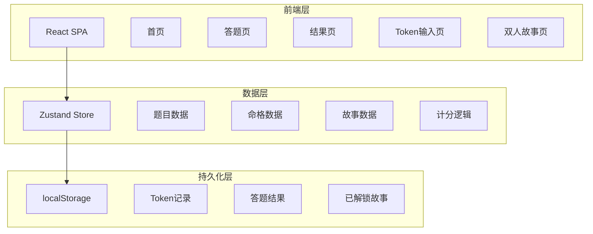
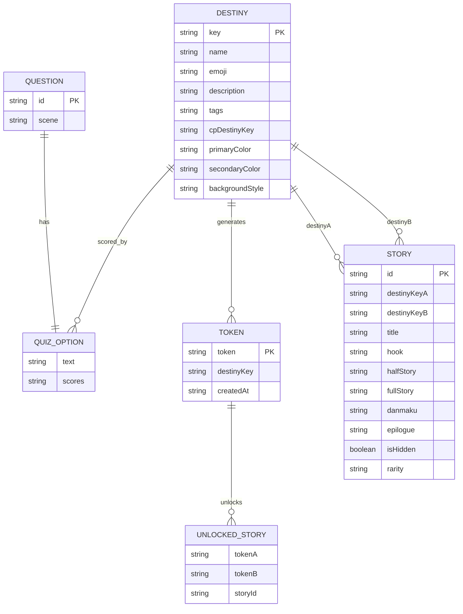

## 1. 架构设计



MVP阶段采用纯前端架构，所有数据客户端管理。后续迭代可接入Express后端+MySQL。

## 2. 技术说明
- 前端：React@18 + TypeScript + Tailwind CSS + Vite
- 初始化工具：vite-init
- 后端：无（MVP阶段纯前端）
- 数据库：无（使用localStorage + 内存数据）
- 状态管理：Zustand
- 路由：react-router-dom
- 动画：framer-motion
- 图标：lucide-react

## 3. 路由定义
| 路由 | 用途 |
|------|------|
| / | 首页，产品介绍+开始测试+Token输入 |
| /quiz | 答题页，8道网文场景题 |
| /result/:token | 结果页，命格展示+Token+分享 |
| /token | Token输入页，输入好友Token |
| /story/:storyId | 双人故事页，完整故事展示 |

## 4. 数据模型

### 4.1 数据模型定义



### 4.2 核心TypeScript类型

```typescript
type DestinyKey =
  | 'STRATEGIST'
  | 'HOTBLOOD'
  | 'COWARD'
  | 'UNDERDOG'
  | 'SLACKER'
  | 'YANDERE'
  | 'CHOSEN_ONE'
  | 'VILLAIN'

interface Destiny {
  key: DestinyKey
  name: string
  emoji: string
  description: string
  tags: string[]
  cpDestinyKey: DestinyKey
  primaryColor: string
  secondaryColor: string
  backgroundStyle: string
}

interface Question {
  id: string
  scene: string
  options: QuestionOption[]
}

interface QuestionOption {
  text: string
  scores: Partial<Record<DestinyKey, number>>
}

interface Story {
  id: string
  destinyKeyA: DestinyKey
  destinyKeyB: DestinyKey
  title: string
  hook: string
  halfStory: string
  fullStory: string
  danmaku: string
  epilogue: string
  tags: string[]
  isHidden: boolean
  rarity: 'normal' | 'hidden'
}
```

## 5. 项目目录结构

```
bookmatch/
├── src/
│   ├── components/
│   │   ├── quiz/
│   │   │   ├── QuestionCard.tsx
│   │   │   └── ProgressBar.tsx
│   │   ├── result/
│   │   │   ├── DestinyCard.tsx
│   │   │   ├── TokenDisplay.tsx
│   │   │   └── SharePanel.tsx
│   │   ├── story/
│   │   │   ├── StoryCard.tsx
│   │   │   ├── HalfStoryCard.tsx
│   │   │   └── Danmaku.tsx
│   │   └── common/
│   │       ├── Button.tsx
│   │       └── ParticleBackground.tsx
│   ├── pages/
│   │   ├── Home.tsx
│   │   ├── Quiz.tsx
│   │   ├── Result.tsx
│   │   ├── TokenInput.tsx
│   │   └── Story.tsx
│   ├── data/
│   │   ├── questions.ts
│   │   ├── destinies.ts
│   │   └── stories.ts
│   ├── hooks/
│   │   └── useQuiz.ts
│   ├── utils/
│   │   ├── scoring.ts
│   │   └── token.ts
│   ├── store/
│   │   └── useAppStore.ts
│   ├── App.tsx
│   ├── main.tsx
│   └── index.css
├── public/
│   └── images/
├── package.json
├── tsconfig.json
├── vite.config.ts
├── tailwind.config.js
└── postcss.config.js
```
